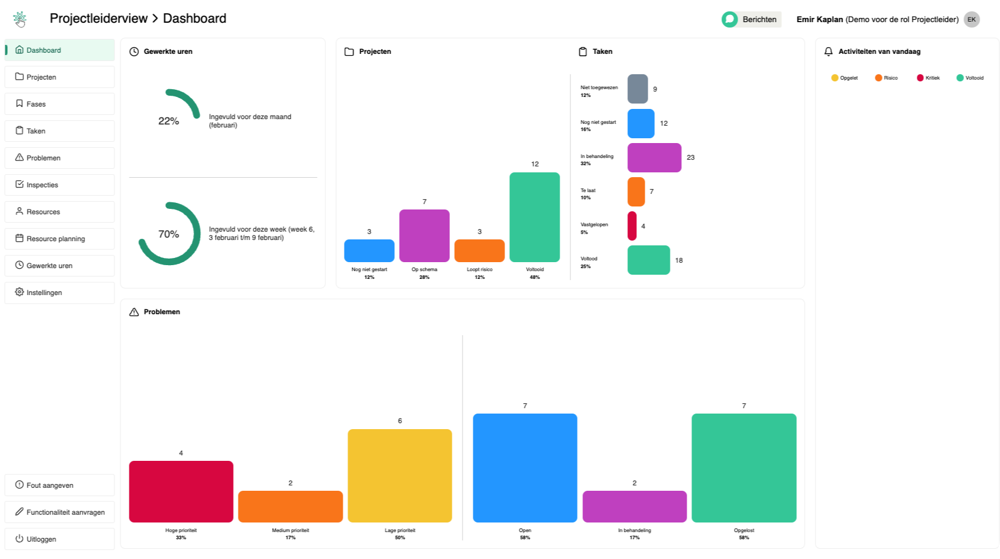
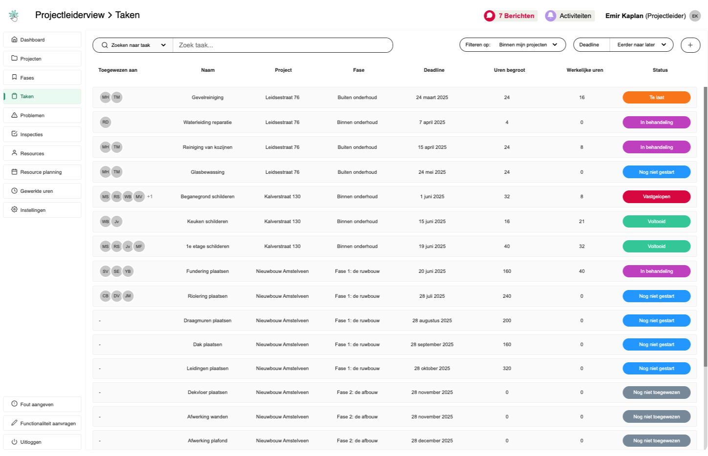
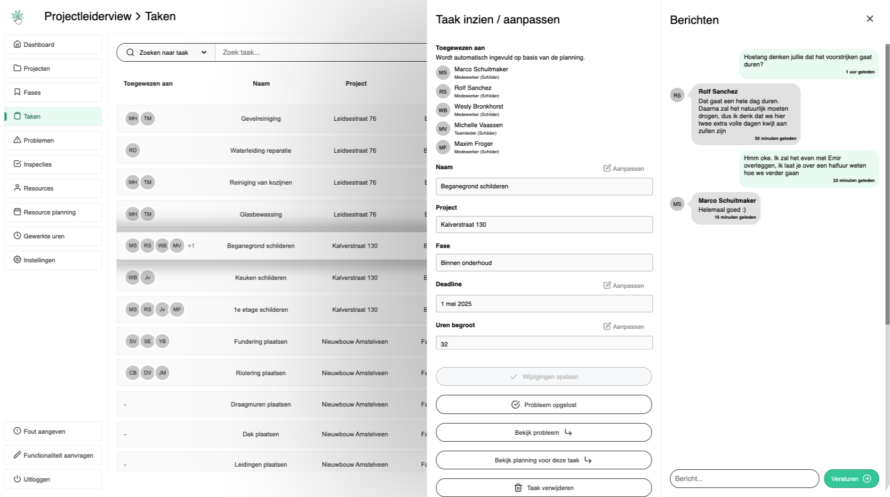
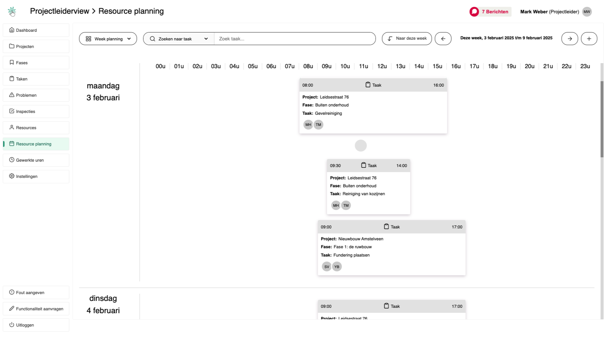
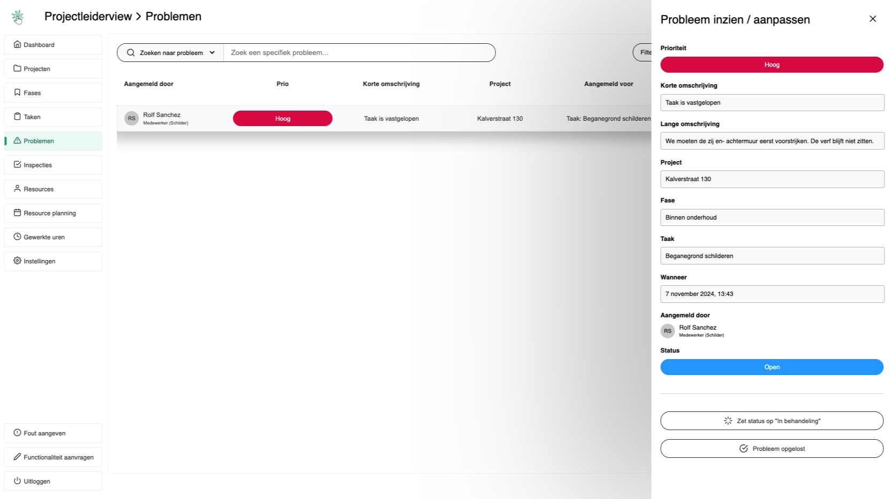
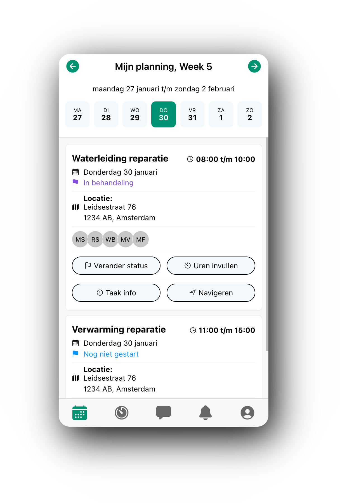

# Proyectoo

Een projectmanagement platform voor de buitendienst. Denk hierbij aan schilders, monteurs, installateurs etc. Het bestaat uit een webapp en een mobiele app.

## Status van het project
Lopend. Het is ongeveer 30% voltooid.
## Kernfuncties

- Projectbeheer
- Budgetbeheer
- Taakbeheer
- Inspectiebeheer
- Probleembeheer
- Resource planning
- Gewerkte uren registratie
- Klantenbeheer

## De tech stack die ik hiervoor heb gebruikt / wil gaan gebruiken

**Webapp:** Next.Js, JavaScript

**Mobiele app:** Angular, Ionic, Capacitor, TypeScript

**Backend:** Node.js, JavaScript, Firebase, FireStore (NoSQL), Algolia

**Unit testing:** Jest

**Versie beheer:** Bitbucket en Jira
## Looptijd
Ongeveer 3 maanden. Begin februari dit jaar ben ik met de ontwikkeling van dit project begonnen.

Ik werk +/- 3 uurtjes per week aan dit project.
## Toekomstplannen
- Het voltooien van de kernfuncties
- Input validatie
- Unit testing
- Logging / monitoring
- Ik wil dit project ook gaan gebruiken om meer te leren over AI. Ik wil me heel graag verdiepen in AI, en dit project geeft mij de kans om daarmee te experimenteren.
## Overige opmerkingen
**Kwaliteit van de code**

Zoals eerder aangegeven heb ik maar +/- 3 uurtjes per week om hieraan te werken. Om te voorkomen dat ik jaren met dit project bezig zou zijn, heb ik ervoor gekozen om hier en daar wat ‘technical debt’ toe te laten. Maar wel zolang het te overzien blijft en de code schaalbaar genoeg is, in de zin dat het leesbaar is en dat aanpassingen snel gedaan kunnen worden.

In de nabije toekomst zal ik de ontwikkeling pauzeren om dit aan te pakken. Denk hierbij aan dingen zoals:

- Betere toepassing van commentaar
- Betere benaming van functies
- Verwijderen van ongebruikte code
- Verwijderen van ongebruikte imports
- Versimpelen van functies en/of losstaande code
- Het globaal maken van herhaalde functies
- Het beter toepassen van semantische elementen

**Projectstructuur**

Het inzien van de code kan op de volgende locaties:

Backend:
- backend/Controllers
- backend/Global

Webapp:
- dashboard/components
- dashboard/helpers
- dashboard/pages

**Taal**

Sinds het begin van mijn programmeercarrière heb ik de gewoonte ontwikkeld om in het engels te programmeren. Vandaar dat vrijwel alles in het engels is.
## Screenshots

